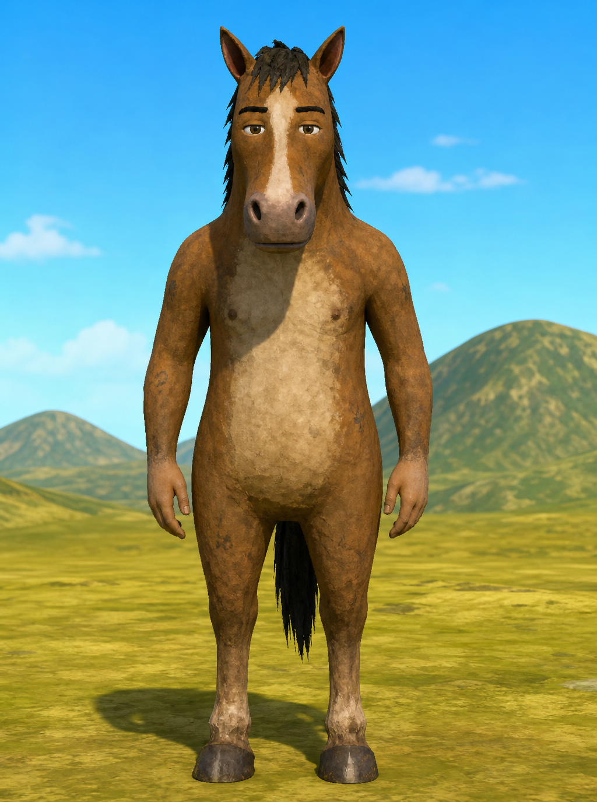
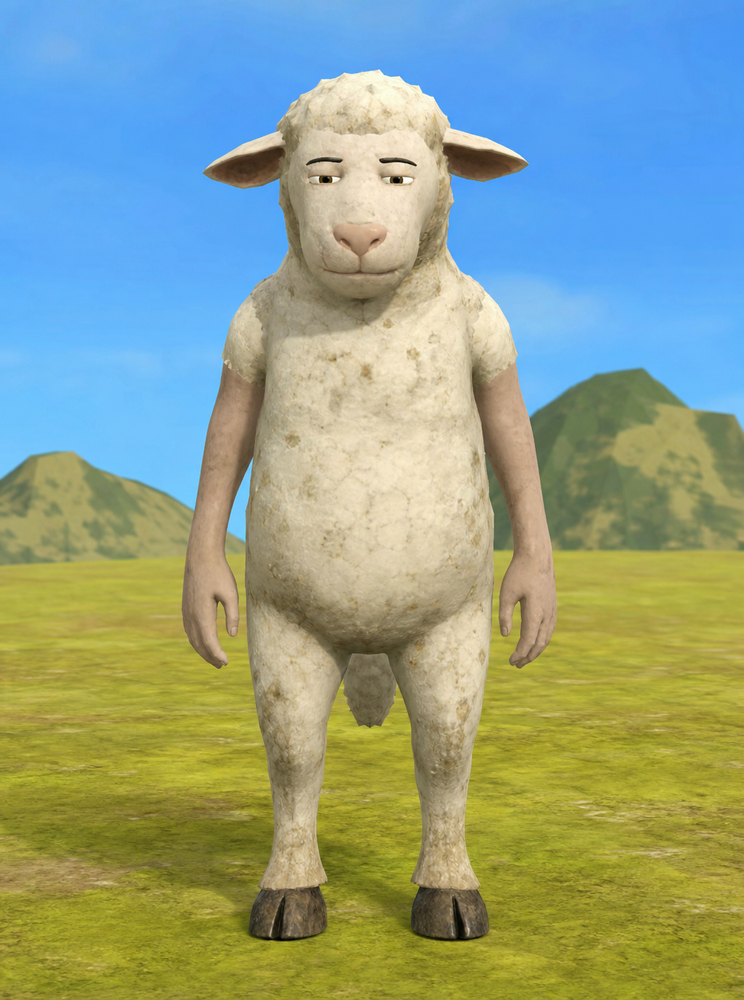
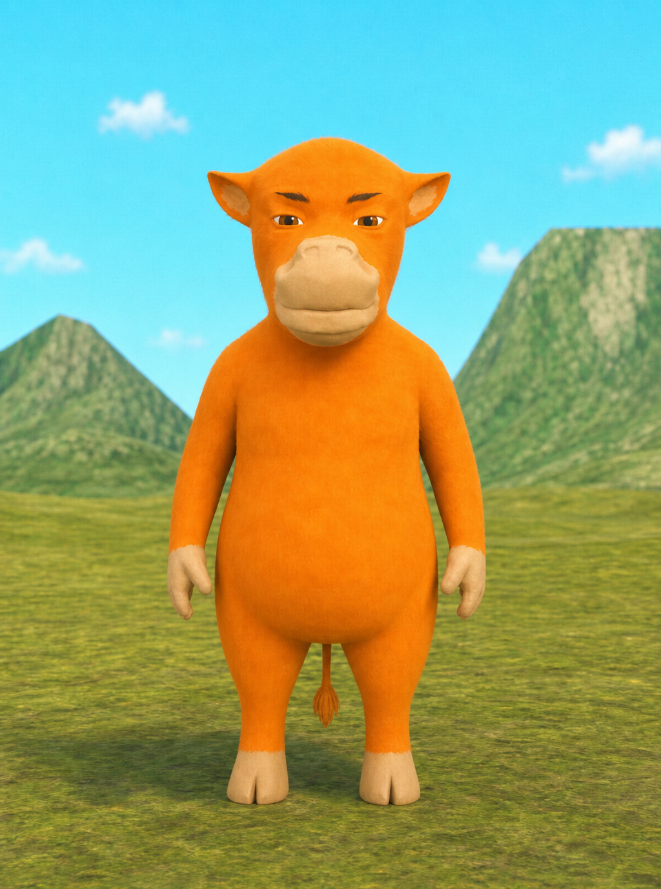
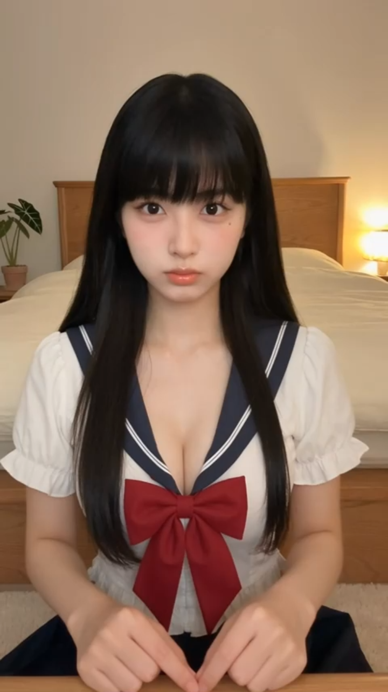
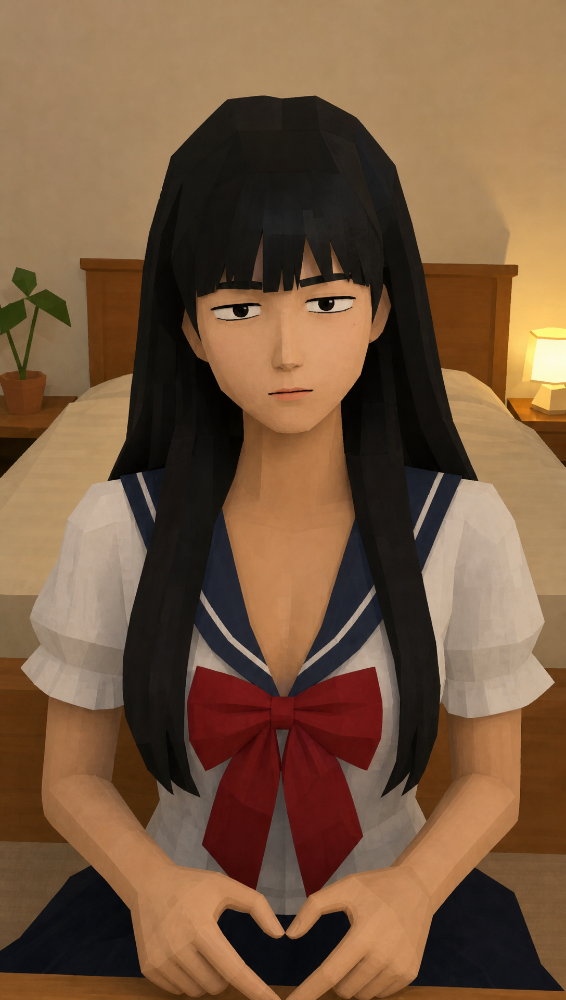
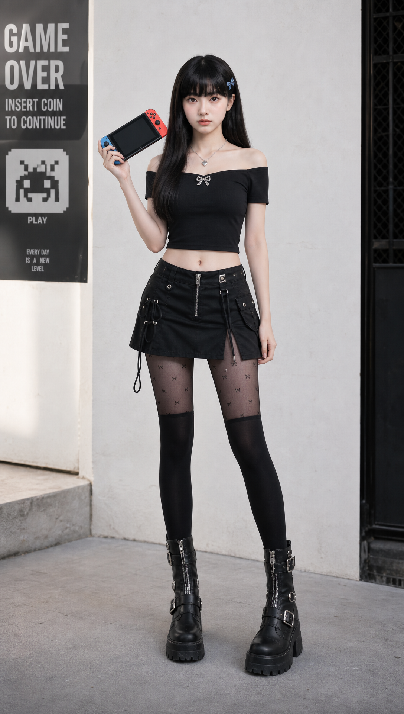
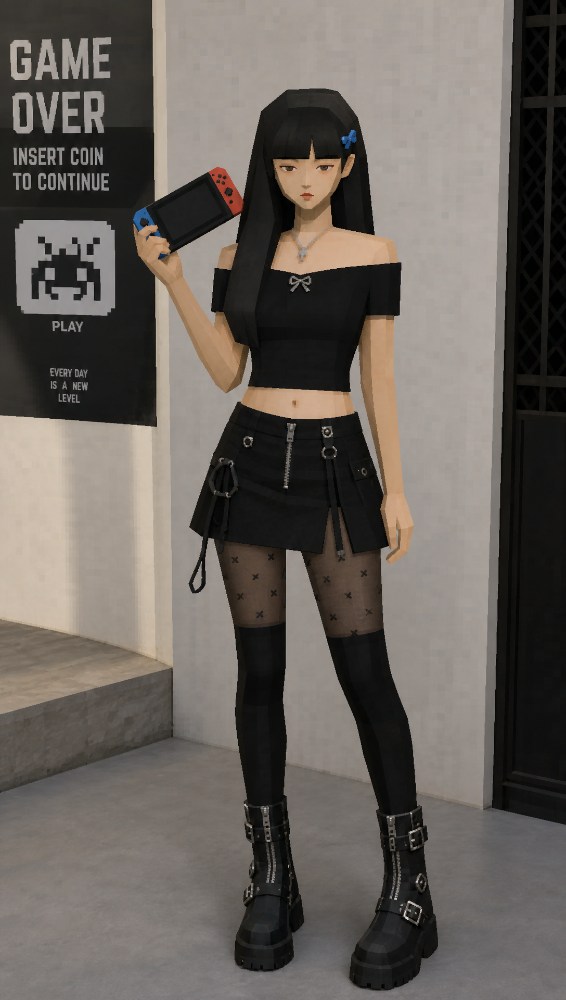

# NiuLai-Style

一个用于生成和转换统一风格简陋 3D 角色图的 Codex Skill。

`niulai` 既可以把任意动物生成成同一套低成本 3D 角色资产，也可以把用户上传的照片或图片转换成同一风格：简陋的局部建模、低清贴图、局部 UV 拉伸错误、滑稽的平面五官，以及廉价旧游戏环境。

## 核心特点

- 严格生成 3:4 竖版、正面、全身角色图
- 默认不需要上传参考图
- 也支持上传任意图片，保留主体、身份、姿势和构图后做风格转换
- 自动判断动物原生形态
- 四足动物拟人化，前肢转换为自然下垂的人手
- 鸟类、蛇、鱼、昆虫等保留原本身体结构
- 躯干保持简单圆钝，头部、四肢、尾巴等复杂部位局部粗糙
- 眼睛和眉毛像简陋的人类五官贴图
- 颜色和花纹根据动物本身变化，不固定使用橘色
- 背景保持高饱和、稀疏、荒凉、低成本旧游戏风格

## 使用方式

在 Codex 中调用：

```text
$niulai 生成一只羊
```

也可以补充辨识特征：

```text
$niulai 生成一只老虎，可选特征：橙黄色身体、黑色条纹、圆耳、长尾巴
```

如果需要把已有图片转成 NiuLai-Style，直接上传原图即可：

```text
$niulai 把这张图转成 NiuLai-Style
```

如果需要调整，直接说明修改对象即可：

```text
$niulai 生成一只马，角色保持不变，背景减少树木，改成荒凉低模山谷
```

## 形态规则

| 动物类型 | 处理方式 |
| --- | --- |
| 四足动物 | 简陋直立拟人化；前肢变成人手，后腿保留动物脚、爪或蹄 |
| 禽类和原生二足动物 | 保留身体、翅膀、喙、腿和爪，不添加人类手臂 |
| 蛇、鱼、蠕虫等无足动物 | 保留原本身体和运动方式，不添加人类四肢 |
| 昆虫、蜘蛛等多足动物 | 保留原本身体结构和足部数量，不强行做人形 |

## 示例

以下示例展示了同一套 Skill 在不同动物上的效果：

| 马形角色 | 羊形角色 | 牛形角色 |
| --- | --- | --- |
|  |  |  |

## 风格转换示例

上传原图后，NiuLai-Style 会保留主体、身份、姿势和构图，再转换成统一的简陋 3D 角色风格。

### 人像转换

| 原图 | NiuLai-Style |
| --- | --- |
|  |  |

### 全身转换

| 原图 | NiuLai-Style |
| --- | --- |
|  |  |

## 风格说明

角色的粗糙感不是全身低模，而是分层产生的：

- 躯干、腹部和髋部使用简单、圆钝、平缓的基础形体
- 头部、口鼻、耳朵、角、手、脚、关节和尾巴使用更粗糙的局部几何
- 复杂部位出现低清贴图拉伸、压缩、错位、颜色溢出和不规则斑驳
- 身体花纹保持动物辨识度，但不规则、不对称、不精致
- 背景元素很少，主要由空旷土地、少量粗糙山丘和简单旧游戏贴图构成

## 文件结构

```text
niulai/
├── SKILL.md
├── agents/
│   └── openai.yaml
├── examples/
│   ├── horse.png
│   ├── sheep.png
│   ├── cow.png
│   ├── portrait-before.png
│   ├── portrait-after.png
│   ├── fullbody-before.png
│   └── fullbody-after.png
└── README.md
```

## 许可

本项目目前未附加独立许可证。使用或再发布前，请根据你的项目需要补充许可证说明。
