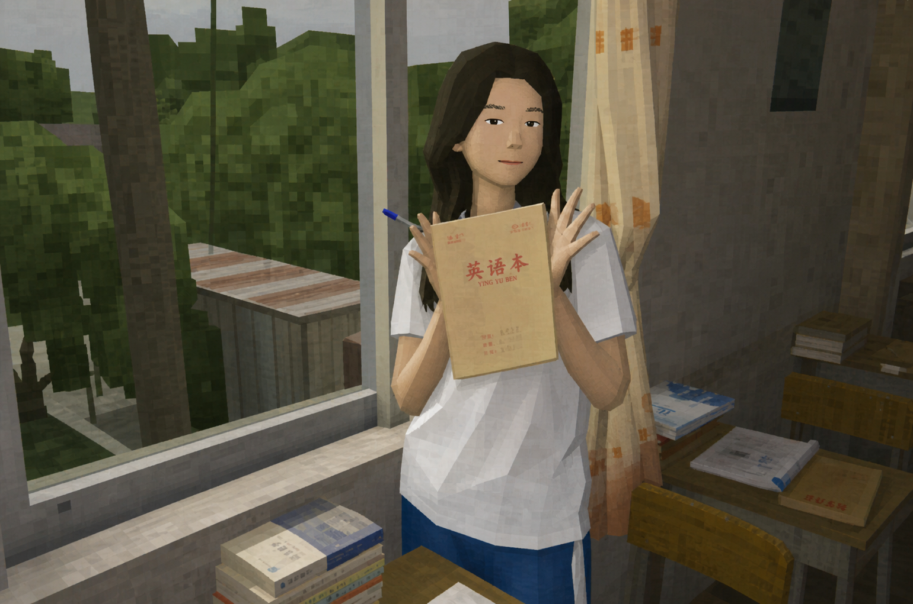

# niulai

一个用于生成和转换统一风格角色图的 Codex Skill。

`niulai` 可以把用户输入的动物，或用户上传的任意图片、照片，转换成同一个低成本 3D 角色项目中的视觉资产：简陋的局部建模、低清贴图、局部 UV 拉伸错误、滑稽的人类式五官，以及稀疏荒凉的旧游戏环境。

## 核心特点

- 严格生成 3:4 竖版、正面、全身角色图
- 支持只输入动物名称，也支持上传图片或照片进行风格转换
- 图片转换时默认保留主体身份、姿势、构图、服装和背景布局
- 自动判断动物原生形态
- 四足动物拟人化，前肢转换为自然下垂的人手
- 鸟类、蛇、鱼、昆虫等保留原本身体结构
- 躯干保持简单圆钝，头部、四肢、尾巴等复杂部位局部粗糙
- 眼睛和眉毛像简陋的人类五官贴图
- 颜色和花纹根据动物本身变化，不固定使用橘色
- 背景保持高饱和、稀疏、荒凉、低成本旧游戏风格

## 使用方式

在 Codex 中调用：

```text
$niulai 生成一只羊
```

也可以补充辨识特征：

```text
$niulai 生成一只老虎，可选特征：橙黄色身体、黑色条纹、圆耳、长尾巴
```

如果需要调整，直接说明修改对象即可：

```text
$niulai 生成一只马，角色保持不变，背景减少树木，改成荒凉低模山谷
```

上传图片后可以直接要求转换：

```text
$niulai 把这张照片转换成 niulai 的简陋3D建模和低清贴图效果，保留人物、姿势、服装和背景构图
```

## 形态规则

| 动物类型 | 处理方式 |
| --- | --- |
| 四足动物 | 简陋直立拟人化；前肢变成人手，后腿保留动物脚、爪或蹄 |
| 禽类和原生二足动物 | 保留身体、翅膀、喙、腿和爪，不添加人类手臂 |
| 蛇、鱼、蠕虫等无足动物 | 保留原本身体和运动方式，不添加人类四肢 |
| 昆虫、蜘蛛等多足动物 | 保留原本身体结构和足部数量，不强行做人形 |

## 示例

以下示例展示了同一套 Skill 在动物生成和人物照片转换上的效果：

| 马形角色 | 人物照片转换 |
| --- | --- |
|  |  |

## 图片转换模式

上传图片时，Skill 默认保留原图中的主体身份、物种或人物身份、姿势、视线、服装、道具、主要颜色、画幅和背景布局，只改变视觉媒介：

- 把真实照片或精致渲染转换成简陋的早期3D游戏资产
- 大面积身体和环境保持简单圆钝，复杂部位使用局部粗糙几何
- 眼睛、眉毛、鼻子和嘴巴采用动物角色同款的浅立体、低清、略错位五官
- 使用低分辨率贴图、局部UV拉伸、颜色溢出和不规则斑驳
- 不把人物强行变成动物，不把近景照片强行补成全身

## 风格说明

角色的粗糙感不是全身低模，而是分层产生的：

- 躯干、腹部和髋部使用简单、圆钝、平缓的基础形体
- 头部、口鼻、耳朵、角、手、脚、关节和尾巴使用更粗糙的局部几何
- 复杂部位出现低清贴图拉伸、压缩、错位、颜色溢出和不规则斑驳
- 身体花纹保持动物辨识度，但不规则、不对称、不精致
- 背景元素很少，主要由空旷土地、少量粗糙山丘和简单旧游戏贴图构成

## 文件结构

```text
niulai/
├── SKILL.md
├── agents/
│   └── openai.yaml
├── examples/
│   ├── horse.png
│   └── human-photo.png
└── README.md
```

## 许可

本项目目前未附加独立许可证。使用或再发布前，请根据你的项目需要补充许可证说明。
